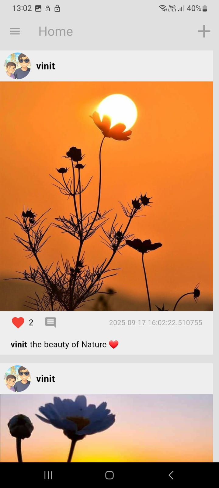
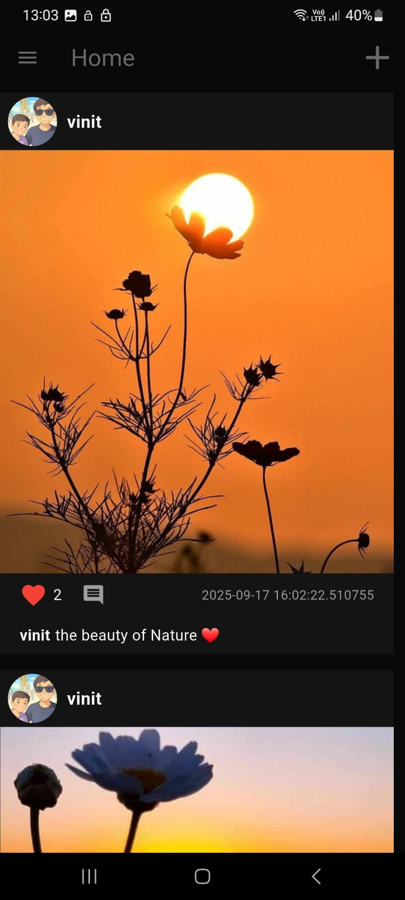
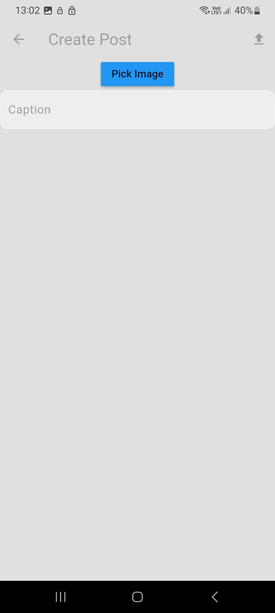
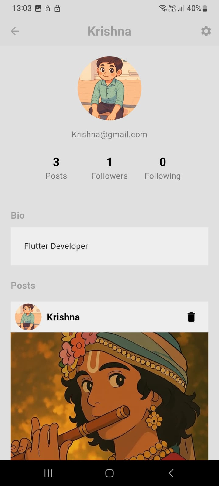
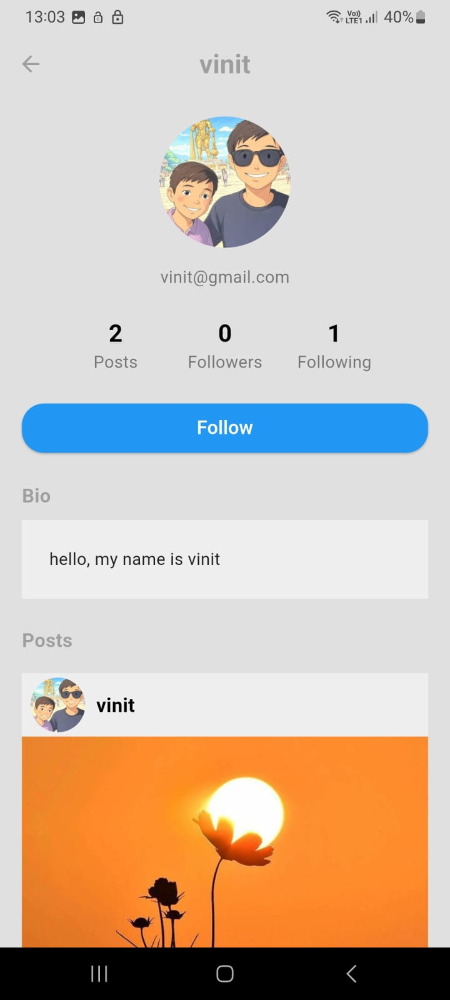
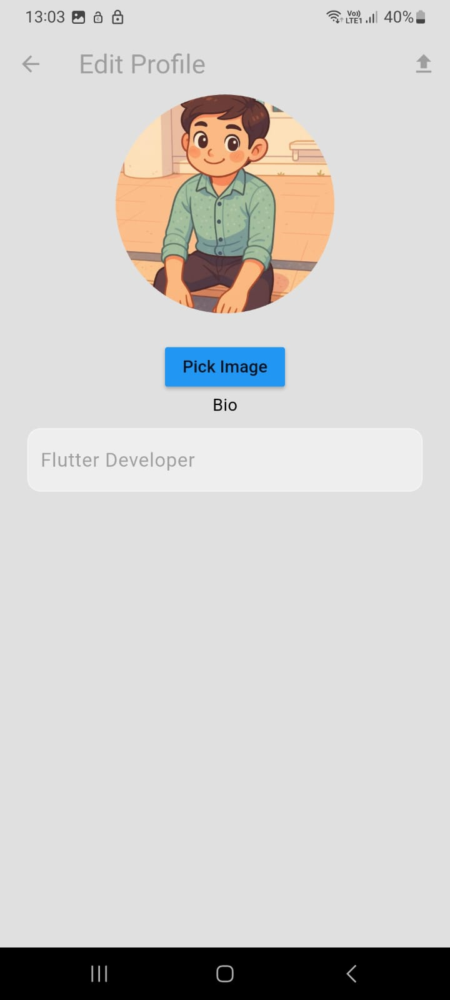
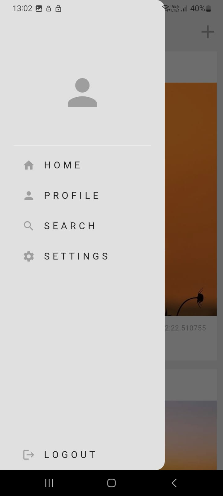
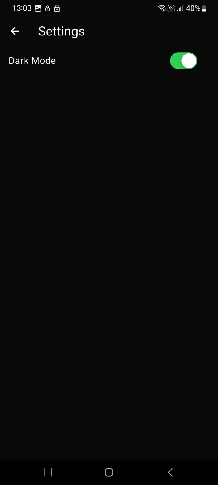

# my_social_media

A Social Media App Clone using Flutter + Firebase + BLoC state management

🔹 Features:
- User Authentication
- Create, Like & Comment on Posts
- Image Upload with Cloudinary
- Dark/Light Mode
- State Management with BLoC

This project helped me explore clean architecture, Firebase integration, and handling state with BLoC.
Excited to keep building and open to feedback

login page:

Home Pages:

create post page:

Profile pages:

Edit profile page:

Drawer page:

Search page:

Settings page:

