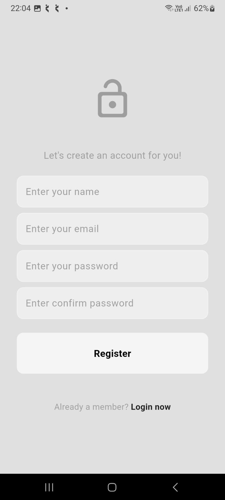
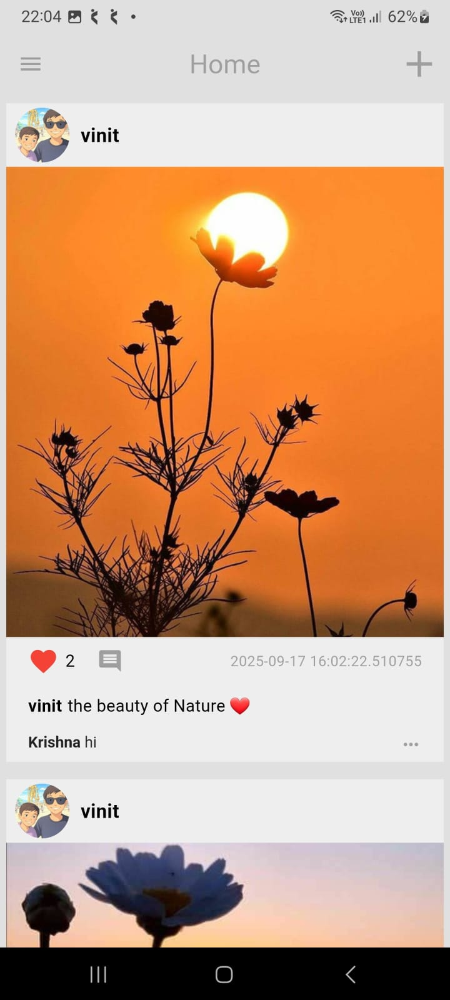
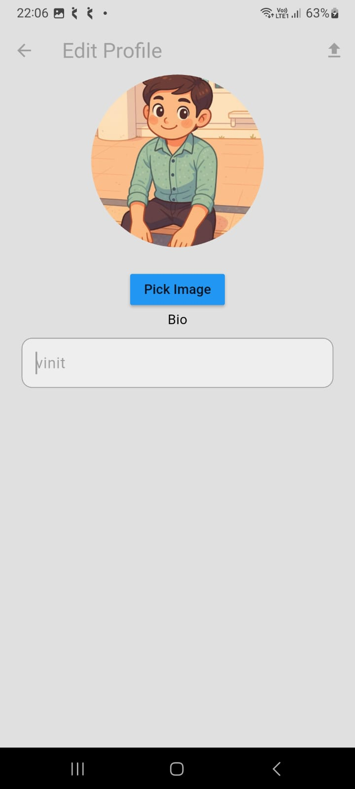
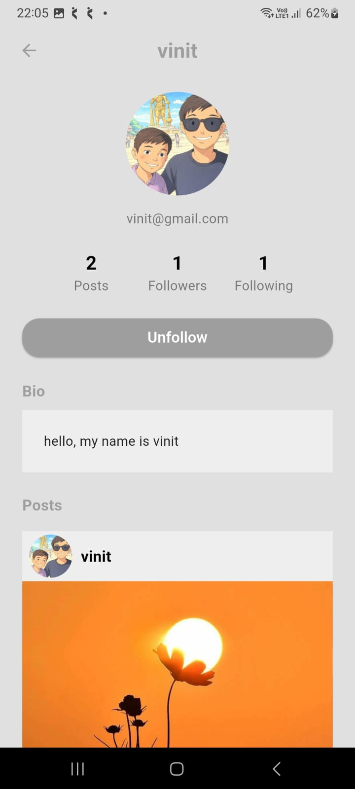
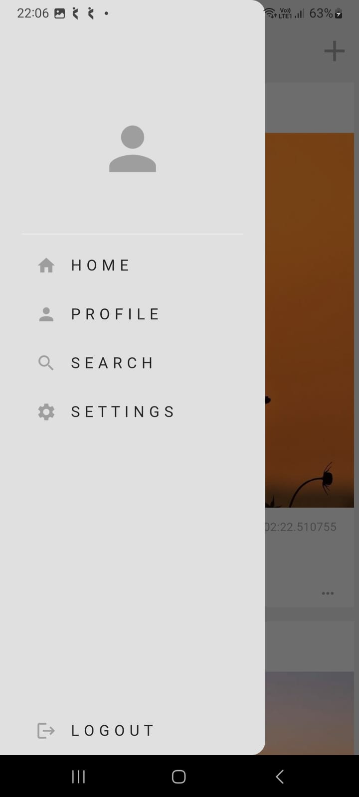
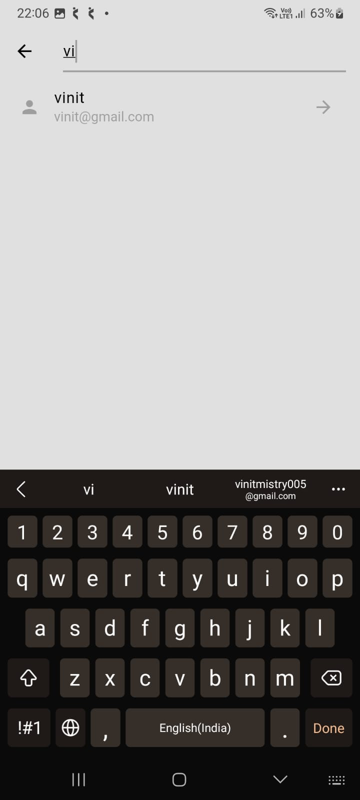
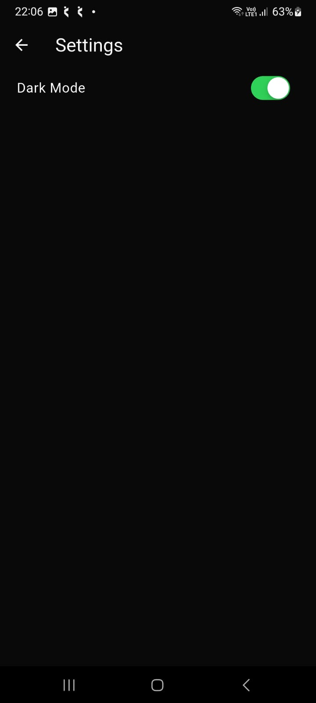

# my_social_media

A Social Media App Clone using Flutter + Firebase + BLoC state management

🔹 Features:
- User Authentication
- Create, Like & Comment on Posts
- Image Upload with Cloudinary
- Dark/Light Mode
- State Management with BLoC

This project helped me explore clean architecture, Firebase integration, and handling state with BLoC.
Excited to keep building and open to feedback

Light mode images of application:

.jpg)

.jpg)

